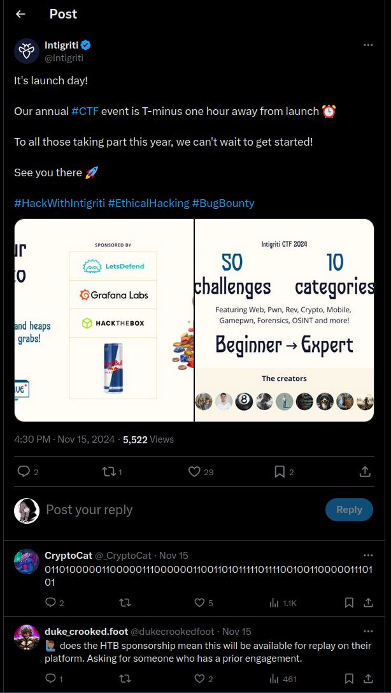
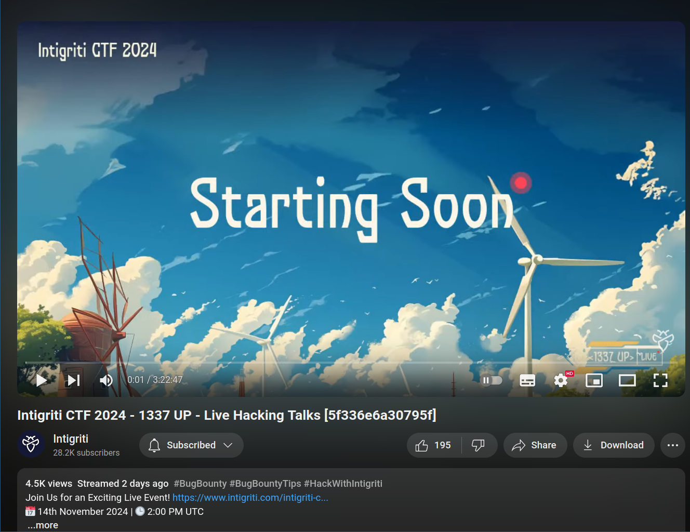

# 1337Up Live CTF
## Socials
Have a look around our socials, maybe you'll find some flags! Don't forget to hit follow while you're there 🥺

Flag format: INTIGRITI{Twitter+YouTube+Reddit}
https://linktr.ee/hackwithintigriti 

# Approach
We are given a format, we first open the linktree link and go to Intigriti's twitter handle. Searching through one of the first few posts we find a comment By CryptoCat


`0110100000110000011100000011001101011111011110010011000001110101`
Seems like this is in Binary. I used `https://www.binaryhexconverter.com/binary-to-ascii-text-converter` and found a part of the flag 

`h0p3_y0u`
 
 ## Second Part 
 Heading over to their youtube, we see that this  video has something strange in the title.
 I suspected that it is in Hexadecimal format. `5f336e6a30795f`
 Using a Hex to ascii converter, I found the next part of the flag
 `_3nj0y_`
 
## Third Part
We head over to Intigriti's Subreddit. Coming across this post we find a comment from CryptoCat
`https://www.reddit.com/r/Intigriti/comments/1grbmj3/watch_our_live_hacking_talks_recording/`
The comment says:
`ZDRfYzdm`
This looks like base64, converting it to text, we get
`d4_c7f`
## Final Flag
```
INTIGRITI{h0p3_y0u_3nj0y_4_c7f}
```
