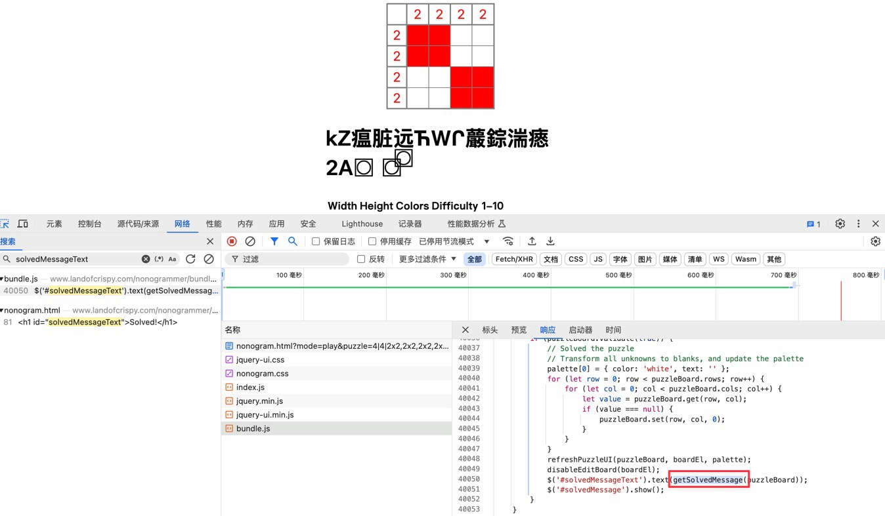
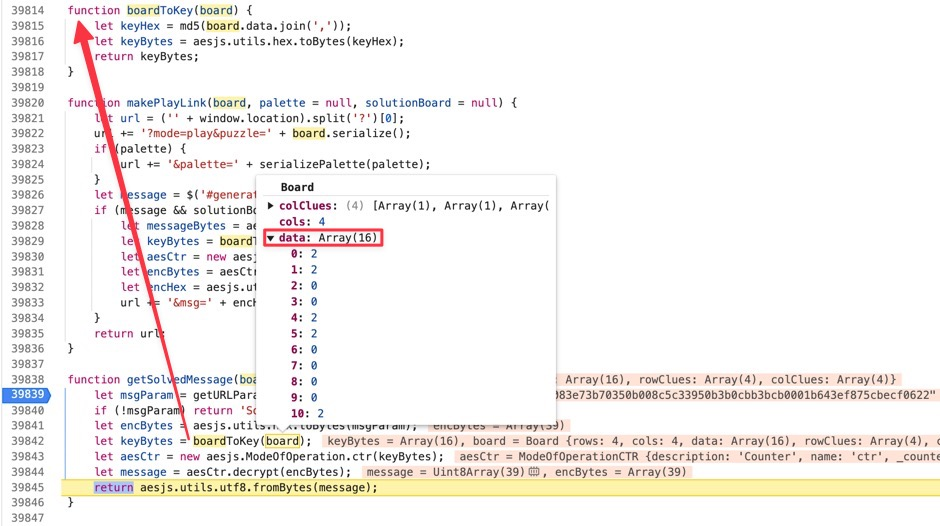
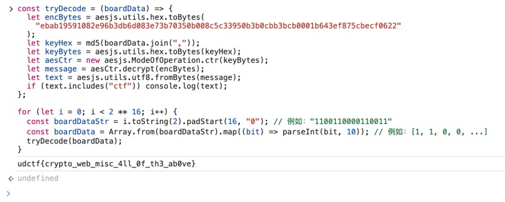

# BlueHens CTF

## Nonogram Pt. 2: Disgraced

> http://www.landofcrispy.com/nonogrammer/nonogram.html?mode=play&puzzle=4|4|2x2,2x2,2x2,2x2|2x2,2x2,2x2,2x2|x,x,x,x,x,x,x,x,x,x,x,x,x,x,x,x&palette=white.grey.X,black..&msg=ebab19591082e96b3db6d083e73b70350b008c5c33950b3b0cbb3bcb0001b643ef875cbecf0622

## Approach

Playing a Nonogram once normally, the displayed text after passing is garbled:


Global search for the function that sets the content of this div:



Make a breakpoint for debugging, and see that the key used for decryption is the current state of the Nonogram panel; while the ciphertext comes from the URL parameters, which is a fixed value.



Attempted two solutions that meet the conditions and found that the decoded messages are all garbled, so I directly wanted to brute force it. Each small piece can be `0`/`1`/`2` (not filled/in black/in red), but I succeeded as soon as I tried the `0`/`1` combinations. The code is as follows, just paste it into the console to run. Note that it should be run before the debugging is finished, otherwise, some local variables will be not defined.

```js
const tryDecode = (boardData) => {
  let encBytes = aesjs.utils.hex.toBytes(
    "ebab19591082e96b3db6d083e73b70350b008c5c33950b3b0cbb3bcb0001b643ef875cbecf0622"
  );
  let keyHex = md5(boardData.join(","));
  let keyBytes = aesjs.utils.hex.toBytes(keyHex);
  let aesCtr = new aesjs.ModeOfOperation.ctr(keyBytes);
  let message = aesCtr.decrypt(encBytes);
  let text = aesjs.utils.utf8.fromBytes(message);
  if (text.includes("ctf")) console.log(text);
};

for (let i = 0; i < 2 ** 16; i++) {
  const boardDataStr = i.toString(2).padStart(16, "0"); // 例如："1100110000110011"
  const boardData = Array.from(boardDataStr).map((bit) => parseInt(bit, 10)); // 例如：[1, 1, 0, 0, ...]
  tryDecode(boardData);
}
```



## Flag

```
udctf{crypto_web_misc_4ll_0f_th3_ab0ve}
```
