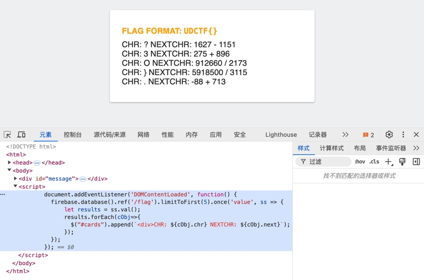

# BlueHens CTF

## lists of JSONs

> https://lists-of-jsons.web.app/

## Approach



`limitToFirst(5)` is not enough, paste the following in the console:

```js
(function () {
  let cardsElement = document.getElementById("cards");
  cardsElement.innerHTML = "";
  firebase
    .database()
    .ref("/flag")
    .limitToFirst(12000)
    .once("value", (ss) => {
      let results = ss.val();
      results.forEach((cObj) => {
        $("#cards").append(`<div>CHR: ${cObj.chr} NEXTCHR: ${cObj.next}`);
      });
    });
})();
```

The number of actual data items is only a little over 1900; it's roughly a structure similar to a linked list, and then use Python to traverse and output.

```python
hints = """CHR: ? NEXTCHR: 1627 - 1151
CHR: 3 NEXTCHR: 275 + 896
CHR: O NEXTCHR: 912660 / 2173
CHR: } NEXTCHR: 5918500 / 3115
CHR: \ NEXTCHR: -1963 + 3668
...
CHR: ! NEXTCHR: (191 * 1) + 46
CHR: E NEXTCHR: (2074 * 0) + 415
CHR: | NEXTCHR: (3310 * 0) + 1422
CHR:  NEXTCHR: -1963 + 3668
CHR: o NEXTCHR: 3775 - 3429
CHR: END NEXTCHR: You got the flag"""

lines = hints.split("\n")
data = []
for line in lines:
    s1, s2 = line.split(" NEXTCHR: ")
    chr = s1[5:]
    if s2 == "exit()" or s2 == "You got the flag":
        data.append((chr, -1))
        continue
    nextpos = int(eval(s2))
    data.append((chr, nextpos))

pos = 0
while True:
    chr, nextpos = data[pos]
    if chr == "END":
        break
    print(chr, end="")
    pos = nextpos
```

The expression is very convenient to process with `eval`, but the `exit()` function is mixed in, so it needs to be filtered out separately.

## Flag

```
UDCTF{JS0N_1n_tr33}
```
