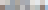
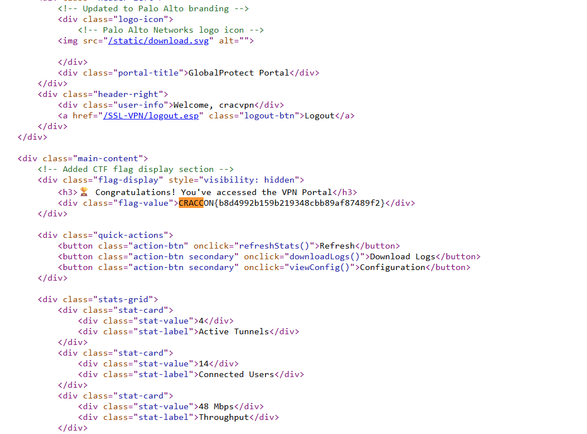

## Solution

We have an image where the password text has been pixelated. We found [this](https://github.com/spipm/Depixelization_poc) repository to depixelize the image.

We extracted the pixelated part first:



Then we ran the depixelization script:

```bash
python depix.py -p chall.png -s images/searchimages/debruinseq_notepad_Windows10_closeAndSpaced.png -o output.png
```

The output image was:


We tried all possible passwords (via Burp Intruder):

```python
for a in "XK":
    for b in "60GC":
        for c in "1Ll":
            for d in range(32, 127):
                print("a" + a + b + c + chr(d) + "a")
```

And we found the password is `aX01sa`.

Logging in with that password, we get the flag in the page source:


