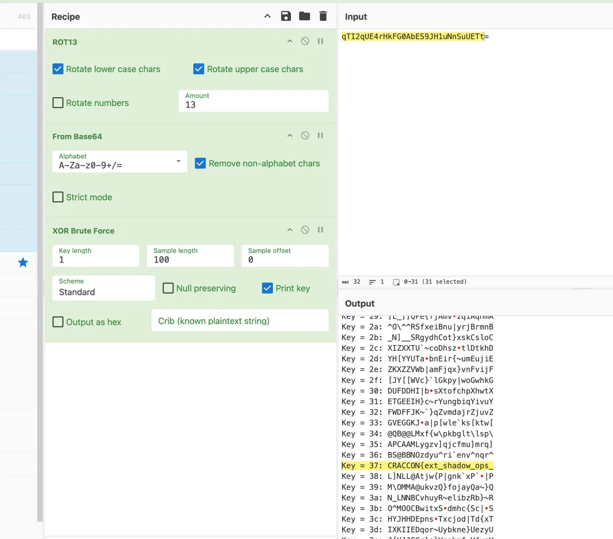

## Solution

We first got the second part of the flag by the following script:

```js
function decodeAndShow(blob, cs = -6) {
  const rev = blob.split("").reverse().join("");
  const base = atob(rev);
  return caesarShift(base, cs);
}

function caesarShift(text, k) {
  return text.replace(/[A-Za-z]/g, (c) => {
    const base = c <= "Z" ? "A".charCodeAt(0) : "a".charCodeAt(0);
    return String.fromCharCode(
      base + ((c.charCodeAt(0) - base + (k % 26) + 26) % 26)
    );
  });
}

console.log(decodeAndShow("=0He1R2Xr12Z4Bje59lYrh3XvNHN0BTc"));
```

The output is `k0n4mi_rev_st0rage_xor}`.

Then we started hunting the first part of the flag. We found the variable `vault` in `background.js` suspicious. We tried various combinations of Caesar shift and XOR, and finally got:



## Flag

```
CRACCON{ext_shadow_ops_k0n4mi_rev_st0rage_xor}
```
