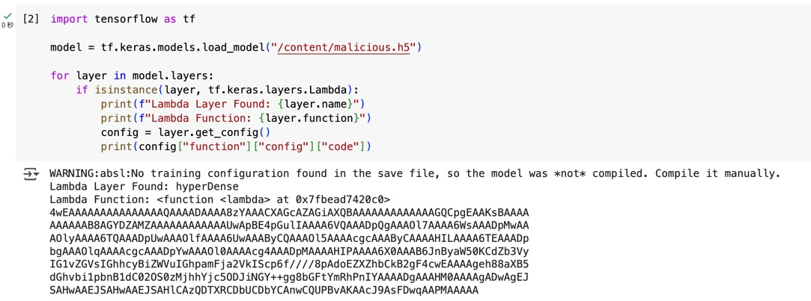

# Malakars Deception

I completed all the ML challenges on [Google Colab](https://colab.google/).

## Approach

In TensorFlow, a _Lambda layer_ is a way to implement custom operations within a neural network model.



After finding the Lambda layer, I tried to decode the Base64 content of `layer.get_config()["function"]["config"]["code"]`:

```js
str = `4wEAAAAAAAAAAAAAAAQAAAADAAAA8zYAAACXAGcAZAGiAXQBAAAAAAAAAAAAAGQCpgEAAKsBAAAA
AAAAAAB8AGYDZAMZAAAAAAAAAAAAUwApBE4pGulIAAAA6VQAAADpQgAAAOl7AAAA6WsAAADpMwAA
AOlyAAAA6TQAAADpUwAAAOlfAAAA6UwAAAByCQAAAOl5AAAAcgcAAAByCAAAAHILAAAA6TEAAADp
bgAAAOlqAAAAcgcAAADpYwAAAOl0AAAAcg4AAADpMAAAAHIPAAAA6X0AAAB6JnByaW50KCdZb3Vy
IG1vZGVsIGhhcyBiZWVuIGhpamFja2VkIScp6f////8pAdoEZXZhbCkB2gF4cwEAAAAgeh88aXB5
dGhvbi1pbnB1dC02OS0zMjhhYjc5ODJiNGY++gg8bGFtYmRhPnIYAAAADgAAAHM0AAAAgADwAgEJ
SAHwAAEJSAHwAAEJSAHlCAzQDTXRCDbUCDbYCAnwCQUPBvAKAAcJ9AsFDwqAAPMAAAAA`;

dec = atob(str);

for (let ch of dec) {
  if (ch.charCodeAt(0) < 128) {
    process.stdout.write(ch);
  }
}
// 6gdtd|fdS)N)HTB{k3r4S_Lr        yrr
//                                    1njrctr0r}z&print('Your model has been hijacked!'))eval)xs z<ipython-input-69-328ab7982b4f<lambda>rs4        H       H       H
// 6
```

But only got a partially correct flag, which is:

```
HTB{k3r4S_L.y...1nj.ct.0.}
```

(I'm not sure why `r` appeared so many times, anyway the characters at the corresponding positions of `r` could not be determined.) But you know it should be "keras layer injection", so ...

```
HTB{k3r4S_L4y3r_1nj3ct10n}
```
