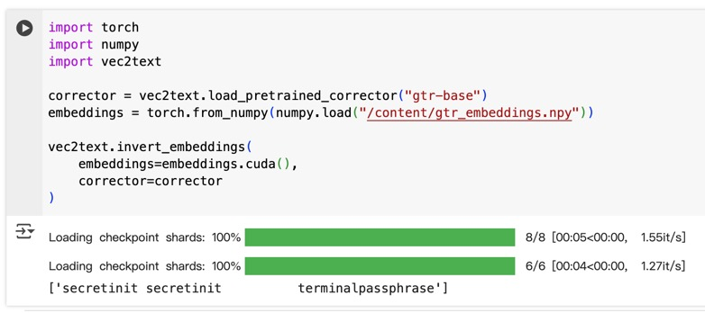
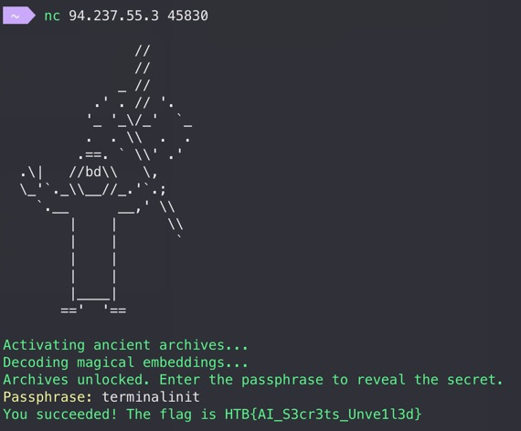

# Reverse Prompt

I completed all the ML challenges on [Google Colab](https://colab.google/).

## Approach

I found [vec2text](https://github.com/vec2text/vec2text) for this challenge.

The following part is a little bit guessy:

But since "passphrase" and "secret" have already appeared in the hint text sent by the server, let's guess the passphrase to be `terminalinit`.
