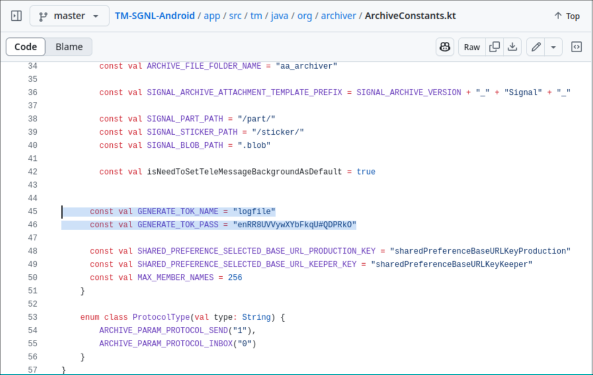
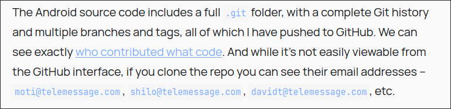
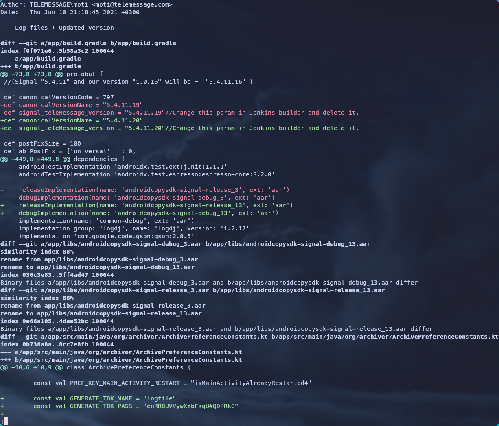

# Sending Mixed Signals

## **Challenge description**

```
Turns out the Houthi PC Small Group was only the tip of the iceberg...  
  
**Connect with:** http://challenge.nahamcon.com:32718
```

## **Solve**

- We access the server and see this page.

!(Signal-main)[./img/Signal-main.png)

- This is the [link](https://www.theatlantic.com/politics/archive/2025/03/trump-administration-accidentally-texted-me-its-war-plans/682151/) they provided in the challenge.
- It talks about some leaked military plan because they used a knock-off version of signal.

- We can find the name of the application by some simple google search.


- We check the first link: https://www.wired.com/story/how-the-signal-knock-off-app-telemessage-got-hacked-in-20-minutes/
- The app name is `TM SGNL`.

- Let's answer the first question: 
`Find the hard-coded credential in the application used to encrypt log files. (format `jUStHEdATA`, no quotes)`

- We  do another google search by searching `TM SGNL hardcoded credentails`
- We find this nice blog: https://micahflee.com/heres-the-source-code-for-the-unofficial-signal-app-used-by-trump-officials/



- The answer to the first question is: `enRR8UVVywXYbFkqU#QDPRkO`


- We scroll down and find the answer to the second question:
`Find the email address of the developer who added the hard-coded credential from question one to the code base (format name@email.site)`



- The answer to the second question is: `moti@telemessage.com`


- For the third question:
`Find the first published version of the application that contained the hard-coded credential from question one (case sensitive, format Word_#.#.#......).`

- We clone the repo for the app that we find in the blog.
- https://github.com/micahflee/TM-SGNL-Android

```sh
git clone https://github.com/micahflee/TM-SGNL-Android
```

- First we need to find the commit where the hardcoded credentials were added.

```sh
git log -S 'enRR8UVVywXYbFkqU#QDPRkO'
```

- We get the following results:

```sh
commit 7e358d2c0883a0ac7a4fd69efab5167e94ac95cf
Author: TELEMESSAGE\Shilo <shilo@telemessage.com>
Date:   Tue Jan 23 23:07:34 2024 +0200

    add packages, drawables

commit 1c47e8ba52c2a9b5d167e199b9cb904f55679a99
Author: TELEMESSAGE\Shilo <shilo@telemessage.com>
Date:   Tue Jan 23 11:32:42 2024 +0200

    new baseline - 1

commit 7da4578dc009a7eddc7ffc471eb202d71826958e
Author: TELEMESSAGE\moti <moti@telemessage.com>
Date:   Tue May 3 15:06:29 2022 +0300

    Merge branch 'master' into NewBaselineAuthentication
    

commit 4f6f1f19de34da2e978d7b623f9f812cf8ff4789
Author: TELEMESSAGE\moti <moti@telemessage.com>
Date:   Mon May 2 15:15:12 2022 +0300

    Self-Authentication V2 in SIGNAL!

commit e9af27c382a86c3f2f666d479c1f7215ed18df (tag: Release_5.4.11.20)
Author: TELEMESSAGE\moti <moti@telemessage.com>
Date:   Thu Jun 10 21:18:45 2021 +0300

    Log files + Updated version
```

- We check the first added commit in 2021: `e9af27c382a86c3f2f666d479c1f7215ed18df9e`

```sh
git show e9af27c382a86c3f2f666d479c1f7215ed18df9e
```



- We verify that it's the commit where the credentials were added.
- We check the tag in the commit and find the version.

![[version.png]]

- The answer to the third question is: `Release_5.4.11.20`

- We input the answers and get the flag.

```
Congrats! Here's the flag: flag{96143e18131e48f4c937719992b742d7}
```


