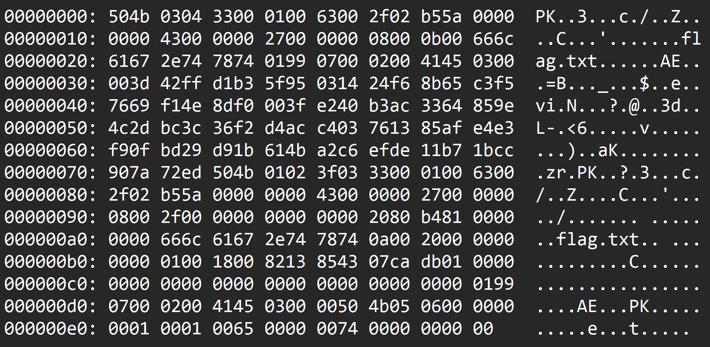

# Screenshot

## **Challenge description**

```
Oh shoot! I accidentally took a screenshot just as I accidentally opened the dump of a `flag.zip` file in a text editor! Whoopsies, what a crazy accidental accident that just accidented!  
  
Well anyway, I think I remember the password was just **`password`**!  
  
**Download the file(s) below.**

**Attachments:** Screenshot.png
```

## **Solve**

- We open the image and see the dump of a zip file.



- We ask chatGPT to write the metadata in the image to a file.
- It gives us the following hex dump:

```sh
50 4b 03 04 33 00 01 00 63 00 2f 02 b5 5a 00 00 00 00 43 00 00 00 27 00 00 00 08 00 0b 00 66 6c 61 67 2e 74 78 74 01 99 07 00 02 00 41 45 03 00 00 3d 42 ff d1 b3 5f 95 03 14 24 f6 8b 65 c3 f5 76 69 f1 4e 8d f0 00 3f e2 40 b3 ac 33 64 85 9e 4c 2d bc 3c 36 f2 d4 ac c4 03 76 13 85 af e4 e3 f9 0f bd 29 d9 1b 61 4b a2 c6 ef de 11 b7 1b cc 90 7a 72 ed 50 4b 01 02 3f 03 33 00 01 00 63 00 2f 02 b5 5a 00 00 00 00 43 00 00 00 27 00 00 00 08 00 2f 00 00 00 00 00 00 00 20 80 b4 81 00 00 00 00 66 6c 61 67 2e 74 78 74 0a 00 20 00 00 00 00 00 01 00 18 00 82 13 85 43 07 ca db 01 00 00 00 00 00 00 00 00 00 00 00 01 99 07 00 02 00 41 45 03 00 00 50 4b 05 06 00 00 00 00 01 00 01 00 65 00 00 00 74 00 00 00 00
```

- We write it to a file using a simple script.

```python
hex_data = """
50 4b 03 04 33 00 01 00 63 00 2f 02 b5 5a 00 00 00 00 43 00 00 00
27 00 00 00 08 00 0b 00 66 6c 61 67 2e 74 78 74 01 99 07 00 02 00
41 45 03 00 00 3d 42 ff d1 b3 5f 95 03 14 24 f6 8b 65 c3 f5 76 69
f1 4e 8d f0 00 3f e2 40 b3 ac 33 64 85 9e 4c 2d bc 3c 36 f2 d4 ac
c4 03 76 13 85 af e4 e3 f9 0f bd 29 d9 1b 61 4b a2 c6 ef de 11 b7
1b cc 90 7a 72 ed 50 4b 01 02 3f 03 33 00 01 00 63 00 2f 02 b5 5a
00 00 00 00 43 00 00 00 27 00 00 00 08 00 2f 00 00 00 00 00 00 00
20 80 b4 81 00 00 00 00 66 6c 61 67 2e 74 78 74 0a 00 20 00 00 00
00 00 01 00 18 00 82 13 85 43 07 ca db 01 00 00 00 00 00 00 00 00
00 00 00 01 99 07 00 02 00 41 45 03 00 00 50 4b 05 06 00 00 00 00
01 00 01 00 65 00 00 00 74 00 00 00 00
"""
data = bytes.fromhex(hex_data)
with open("output.zip", "wb") as f:
    f.write(data)
```

- Then we unzip it using the password from the description: `password`.

```sh
7z x output.zip
```

- And get the flag.

```sh
cat flag.txt

flag{907e5bb257cd5fc818e88a13622f3d46}
```

