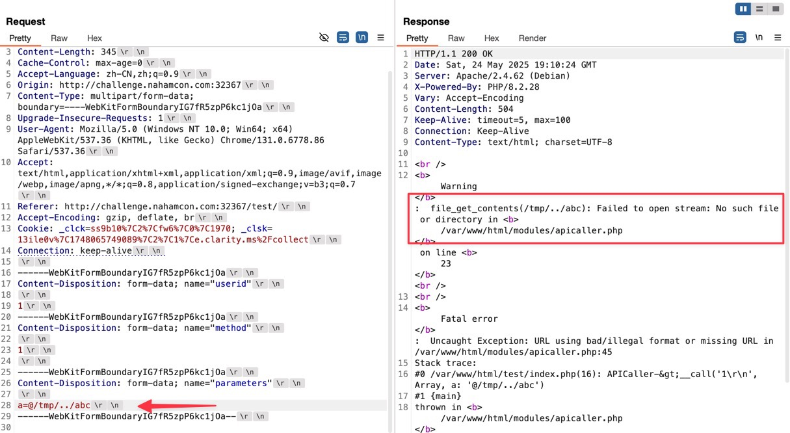
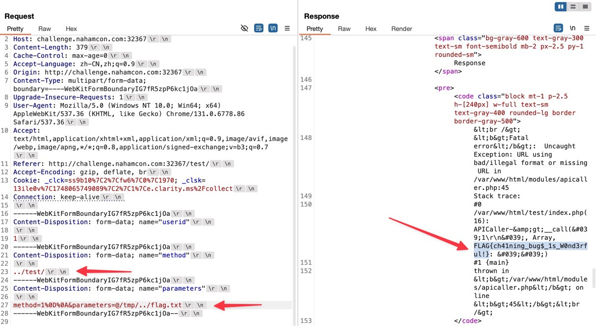

## exp1.jpg


By appending an extra `\r\n` to the `method` parameter, the server throws an error and responds with the error message.
Note that the error message reflects the value of parameters.

## exp2.jpg



This can also be used for file existence enumeration. (And found `/flag.txt` exists.)

## exp3.jpg



According to `apicaller.php.orig`, parameters like `@/tmp/<file>` will be parsed as file contents, and there is a path
traversal vulnerability in both `method` and `parameters`.

Make a request to the `../test/` API again, set the `method` parameter to a value that causes the error,
like `1\r\n`, and set the `parameters` parameter to `@/tmp/../flag.txt`. The server will reflect the contents of the
file, which is the flag.

## flag

```
FLAG{ch41ning_bug$_1s_W0nd3rful!}
```
