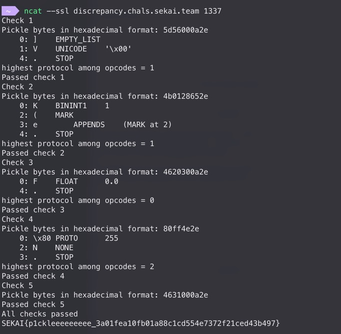

# SekaiCTF - discrepancy

## Approach

```python
payloads = [
    b']V\x00\n.',  # fuzz...
    b'K\x01(e.',  # https://github.com/python/cpython/issues/135573
    b'F 0\n.',  # https://github.com/python/cpython/issues/135580
    b'\x80\xffN.',  # malformed protocol
    b'F1\x00\n.',  # https://github.com/python/cpython/issues/126996
]
```

```
b_1: b']V\x00\n.' 5d56000a2e
b_2: b'K\x01(e.' 4b0128652e
b_3: b'F 0\n.' 4620300a2e
b_4: b'\x80\xffN.' 80ff4e2e
b_5: b'F1\x00\n.' 4631000a2e
```

