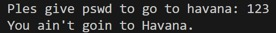
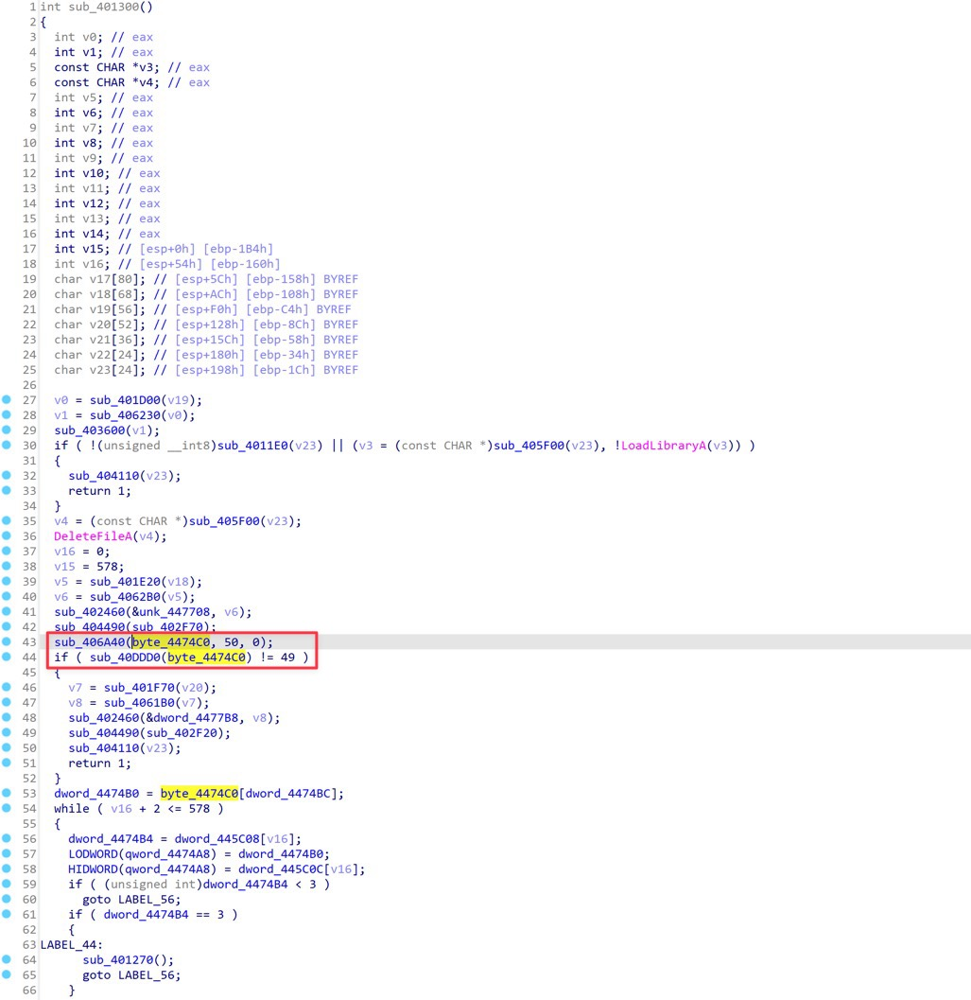
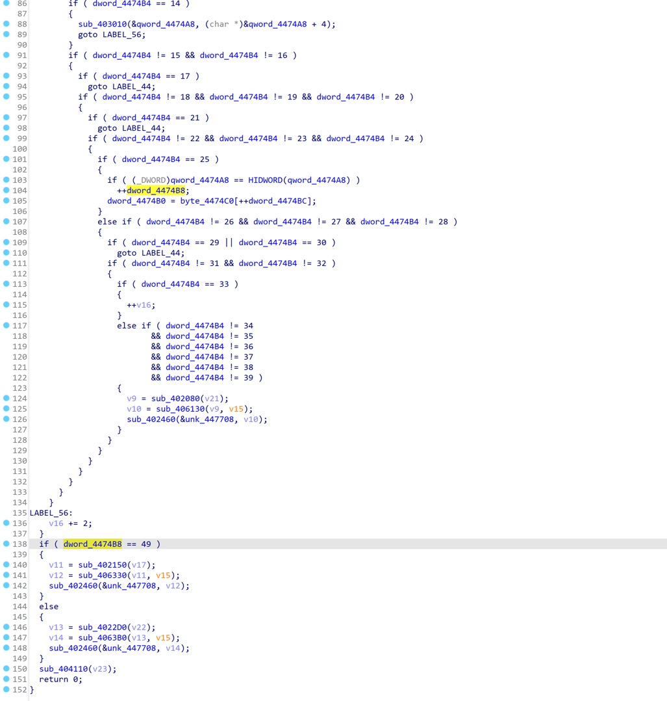

# Shakti CTF - havana32

## Approach

The binary checks a password:



After some quick static analysis, I notice that there's a suspicious function `sub_401300`, it calls `sub_406A40` to read data into a buffer `byte_4474C0`, and verifies the length is `49`.



There's great chance that the password is the flag, which is `49` bytes long.

Function `sub_401300` seems to implement a VM with a custom instruction set, however, we don't need to fully understand it to solve the challenge. I notice that `dword_4474B8 == 49` is checked before the function returns, and there's also `++dword_4474B8` at line 104, this looks like a verification of the password byte by byte.



So the idea is to hook the function `sub_401300` and dump the buffer `byte_4474C0` before the function returns.

When I input with the flag prefix `shaktictf`, the value of `byte_4474C0` before `sub_401300` returns is the length of matched bytes. This allows me to brute-force the password byte by byte.

`hook.js`:

```javascript
const base = Module.findBaseAddress("havana32.exe");

const fn_read = base.add(0x6a40); // read buffer
const var_buffer = base.add(0x474c0); // buffer
Interceptor.replace(
  fn_read,
  new NativeCallback(
    function (a1, a2, a3) {
      console.log(
        "fn_read called, arg1=" + a1 + ", (buffer=" + var_buffer + ")"
      );
      const input = "[INPUT]";
      Memory.writeAnsiString(var_buffer, input);
      console.log(
        "Data written to var_buffer: " + var_buffer.readAnsiString(),
        input.length
      );
      return 1;
    },
    "int",
    ["pointer", "int", "int"]
  )
);

const fn_vm_main = base.add(0x1300);
const var_matched = base.add(0x474b8); // matched count
Interceptor.attach(fn_vm_main, {
  onLeave: function () {
    const matched = Memory.readU32(var_matched);
    console.log("matched:", matched);
    send({ matched: matched });
  },
});
```

`exp.py`:

```python
import frida
import time


def pad49(password):
    return (password + "." * 100)[:49]


def try_password(password, expected_matched):
    pid = frida.spawn(["havana32.exe"])
    session = frida.attach(pid)
    script_code = open("hook.js", "r").read()
    script_code = script_code.replace("[INPUT]", pad49(password))
    script = session.create_script(script_code)
    ok = False

    def on_message(message, data):
        nonlocal ok
        if message["type"] == "send":
            matched = message["payload"]["matched"]
            if matched == expected_matched:
                ok = True

    script.on("message", on_message)
    script.load()
    frida.resume(pid)
    time.sleep(0.2)
    session.detach()
    return ok


alphabet = "ABCDEFGHIJKLMNOPQRSTUVWXYZabcdefghijklmnopqrstuvwxyz0123456789_{}"
flag = "shaktictf{"
while not flag.endswith("}"):
    for ch in alphabet:
        ok = try_password(flag + ch, len(flag) + 1)
        if ok:
            flag += ch
            print(f"[*] Current flag: {flag}")
            break

# shaktictf{H4lf_0f_mY_H34rt_1s_1n_H4v4n4_0oH_n4n4}
```

## Flag

```
shaktictf{H4lf_0f_mY_H34rt_1s_1n_H4v4n4_0oH_n4n4}
```
