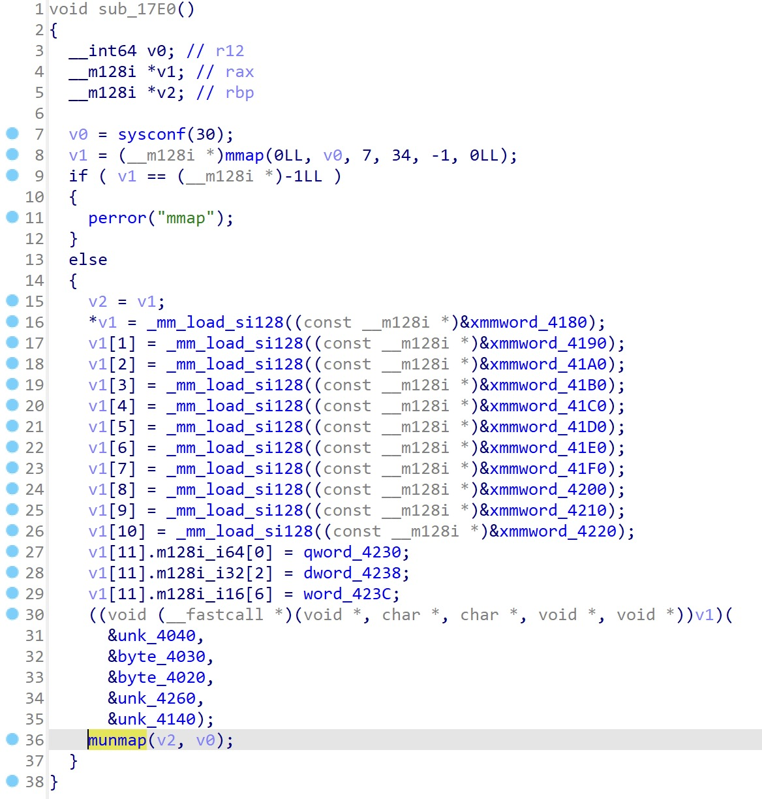
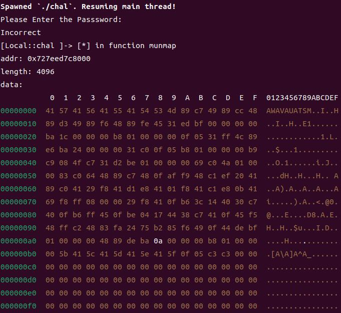
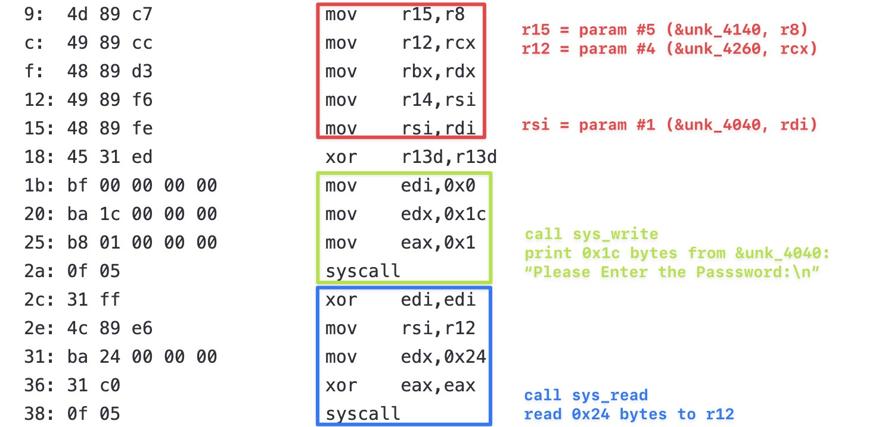

# You Shall Not Passss

## Approach

The code is dynamically generated, I use frida to hook the `munmap` function, so that I can get the start address of `v1` by printing the first argument, then I can get the memory content of `v1`.



The frida script `debug.js` is as follows:

```js
Interceptor.attach(Module.findExportByName(null, "munmap"), {
  onEnter: function (args) {
    const addr = args[0];
    const length = args[1].toInt32();
    console.log("[*] in function munmap");
    console.log("addr:", addr);
    console.log("length:", length);

    const data = Memory.readByteArray(addr, 0x100);
    console.log("data:");
    console.log(hexdump(data, { ansi: true }));
  },
});
```

Run `frida -f ./chal -l ./debug.js`:



I use [this site](https://defuse.ca/online-x86-assembler.htm) to decompile the obtained assembly code, and the decompiled code is as follows:

```
0:  41 57                   push   r15
2:  41 56                   push   r14
4:  41 55                   push   r13
6:  41 54                   push   r12
8:  53                      push   rbx
9:  4d 89 c7                mov    r15,r8
c:  49 89 cc                mov    r12,rcx
f:  48 89 d3                mov    rbx,rdx
12: 49 89 f6                mov    r14,rsi
15: 48 89 fe                mov    rsi,rdi
18: 45 31 ed                xor    r13d,r13d
1b: bf 00 00 00 00          mov    edi,0x0
20: ba 1c 00 00 00          mov    edx,0x1c
25: b8 01 00 00 00          mov    eax,0x1
2a: 0f 05                   syscall
2c: 31 ff                   xor    edi,edi
2e: 4c 89 e6                mov    rsi,r12
31: ba 24 00 00 00          mov    edx,0x24
36: 31 c0                   xor    eax,eax
38: 0f 05                   syscall
3a: b8 01 00 00 00          mov    eax,0x1
3f: b9 c9 08 4f c7          mov    ecx,0xc74f08c9
44: 31 d2                   xor    edx,edx
46: be 01 00 00 00          mov    esi,0x1
4b: 69 c0 4a 01 00 00       imul   eax,eax,0x14a
51: 83 c0 64                add    eax,0x64
54: 48 89 c7                mov    rdi,rax
57: 48 0f af f9             imul   rdi,rcx
5b: 48 c1 ef 20             shr    rdi,0x20
5f: 41 89 c0                mov    r8d,eax
62: 41 29 f8                sub    r8d,edi
65: 41 d1 e8                shr    r8d,1
68: 41 01 f8                add    r8d,edi
6b: 41 c1 e8 0b             shr    r8d,0xb
6f: 41 69 f8 ff 08 00 00    imul   edi,r8d,0x8ff
76: 29 f8                   sub    eax,edi
78: 41 0f b6 3c 14          movzx  edi,BYTE PTR [r12+rdx*1]
7d: 40 30 c7                xor    dil,al
80: 40 0f b6 ff             movzx  edi,dil
84: 45 0f be 04 17          movsx  r8d,BYTE PTR [r15+rdx*1]
89: 44 38 c7                cmp    dil,r8b
8c: 41 0f 45 f5             cmovne esi,r13d
90: 48 ff c2                inc    rdx
93: 48 83 fa 24             cmp    rdx,0x24
97: 75 b2                   jne    0x4b
99: 85 f6                   test   esi,esi
9b: 49 0f 44 de             cmove  rbx,r14
9f: bf 01 00 00 00          mov    edi,0x1
a4: 48 89 de                mov    rsi,rbx
a7: ba 0a 00 00 00          mov    edx,0xa
ac: b8 01 00 00 00          mov    eax,0x1
b1: 5b                      pop    rbx
b2: 41 5c                   pop    r12
b4: 41 5d                   pop    r13
b6: 41 5e                   pop    r14
b8: 41 5f                   pop    r15
ba: 0f 05                   syscall
bc: c3                      ret
bd: c3                      ret
```

In x86_64, when the number of parameters is less than `6`, they are passed via registers `rdi`, `rsi`, `rdx`, `rcx`, `r8` and `r9`. So the first several instructions are:



The `4b`\~`97` part of the code is a loop, which is used to compare the `al ^ input[i]` (`78`\~`7d`) with `unk_4140[i]` (`84`\~`89`). Fortunately the content of `unk_4140` is not modified dynamically, so we can get the content of `unk_4140` by statically analyzing the code.

If the `input` is real flag, the comparison will be passed. So the last step is to recover the calculation process of `al ^ input[i]`. Here's the Python code:

```python
unk_4140 = [
    0xDD, 0x9A, 0xDE, 0x4E, 0x69, 0xE1, 0xE9, 0x2C,
    0xD2, 0x4E, 0xEC, 0xE7, 0x18, 0x26, 0x6A, 0x56,
    0x79, 0xD8, 0xA3, 0x55, 0x72, 0xBC, 0x76, 0xC4,
    0x0C, 0x0F, 0x9B, 0xBE, 0xC6, 0x81, 0xE2, 0x41,
    0x47, 0xA0, 0xF4, 0x26
]


def loop():
    eax = 1
    ecx = 0xC74F08C9

    for rdx in range(0x24):
        eax = eax * 0x14A
        eax += 0x64
        rdi = eax
        rdi *= ecx
        rdi >>= 0x20
        r8d = eax
        r8d -= rdi
        r8d >>= 1
        r8d += rdi
        r8d >>= 0xB
        edi = r8d * 0x8FF
        eax -= edi

        # enumerate each character of the real flag
        for ch in range(255):
            al = eax & 0xFF
            if ch ^ al == unk_4140[rdx]:
                print(chr(ch), end="")
                break

        rdx += 1


loop()

# swampCTF{531F_L0AD1NG_T0TALLY_RUL3Z}
```
