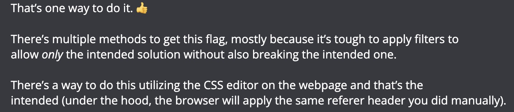

# Editor

## Approach

```python
import requests

url = "http://chals.swampctf.com:47821/flag.txt"

resp = requests.get(url, headers={"Referer": "http://chals.swampctf.com:47821/"})

print(resp.text, resp.status_code)

# swampCTF{c55_qu3r135_n07_j5}
```

I opened a ticket to ask whether this was an intended solution, and here's the messages from the mod:


