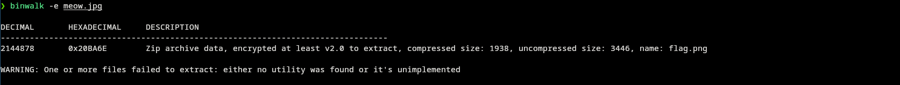
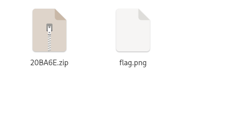
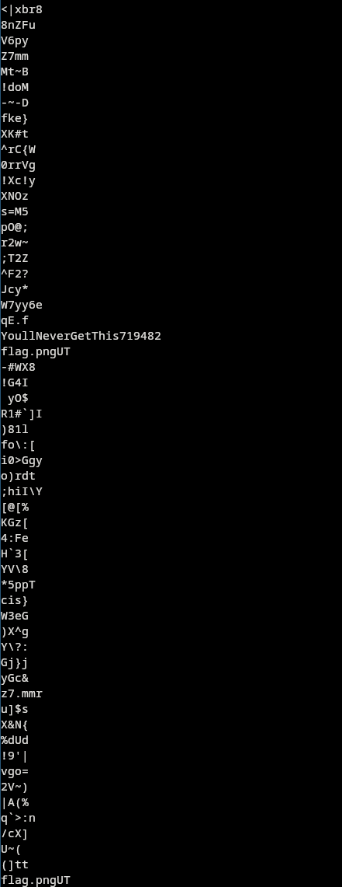

# 1337Up Live CTF
## In Plain Sight
Barely hidden tbh..
## Approach
We find that we are given a jpg image file called meow.jpg
Running it through `binwalk`, there is a compressed zip archive with a password in it. 



We have an encrypted Zip file but no password now


Running the `meow.jpg` through strings we find something interesting 


Trying `YoullNeverGetThis719482`  as the password we are able to sucessfully decrypt it. 
We get a file called `flag.png` which is completely blank


Uploading the `flag.png` to `https://aperisolve.com` we are able to view the [flag](https://www.aperisolve.com/ed9edd995a595a8a6e359ec6719ede98)


## The Flag is: 
```
INTIGRITI{w4rmup_fl46z}
```

